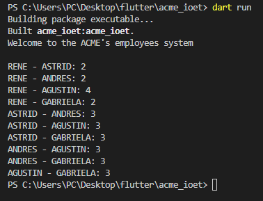
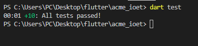

# IOET - Acme technical test
## Statement
The company ACME offers their employees the flexibility to work the hours they want. But due to some external circumstances they need to know what employees have been at the office within the same time frame.
The goal of this exercise is to output a table containing pairs of employees and how often they have coincided in the office.

The input is the name of an employee and the schedule they worked, indicating the time and hours. This should be a .txt file with at least five sets of data. You can include the data from our examples below:

### Example 1
#### Input:
    RENE=MO10:00-12:00,TU10:00-12:00,TH01:00-03:00,SA14:00-18:00,SU20:00- 21:00
    ASTRID=MO10:00-12:00,TH12:00-14:00,SU20:00-21:00 
    ANDRES=MO10:00-12:00,TH12:00-14:00,SU20:00-21:00 
#### Output:

    ASTRID-RENE: 2  
    ASTRID-ANDRES: 3  
    RENE-ANDRES: 2
    
### Example 2
#### Input:

    RENE=MO10:15-12:00,TU10:00-12:00,TH13:00-13:15,SA14:00-18:00,SU20:00-21:00  
    ASTRID=MO10:00-12:00,TH12:00-14:00,SU20:00-21:00

#### Output:

    RENE-ASTRID: 3

## Solution  
To create a solution for this problem I've decided use Dart as a programming language under a methodology based in create an first prototype with the main goal of understand the exercise statement and the requirements to then increment the functionalities, efficiency and apply good practices.

### Architecture 
For this project I've applied an monolithic three-layer architecture which it's describe below:
In this approach the application's components can be describe as a part of one of tree layers:      
 

    

 

 1. ***Presentation:*** This is what the users see and in this case include the acme.ioet.dar which shows the application's output.
 2. ***Business tier:*** Is the main core of the application and includes the business logic and the modeling of the entities (Employee, Days, Schedule).
 3. ***Data tier:*** Responsible for managing, read and write access to the data. In this case, the data is a simple .txt file located in the data folder and therefore only includes one class to access it (readFileByLines).
 
It's say this application is monolithic due this tiers running under a one single platform and program, ie, isn't a microservices approach.

### How to run the application (Windows)
To run the application and its test is necessary install Dart in your computer, more information is available in [Get the Dart SDK](https://dart.dev/get-dart). After install Dart, you can run the app and tests in the windows' CMD using the next commands in the app's top directory:

    dart run
    dart test

Let's see the application running. At first, it needs a minimum of five rows of data as an input. In this case:

    RENE=MO10:00-12:00,TU10:00-12:00,TH01:00-03:00,SA14:00-18:00,SU20:00-21:00
    ASTRID=MO10:00-12:00,TH12:00-14:00,SU20:00-21:00
    ANDRES=MO10:00-12:00,TH12:00-14:00,SU20:00-21:00
    AGUSTIN=MO10:15-12:00,TU10:00-12:00,TH13:00-13:15,SA14:00-18:00,SU20:00-21:00
    GABRIELA=MO10:00-12:00,TH12:00-14:00,SU20:00-21:00

If there are less than five rows or at least one of them hasn't the correct format then the program will throw an exception and show and error message. If the conditions are met, then the output will be:

 

    

 

In order to verify the application we can run all the tests:  

 

    

 